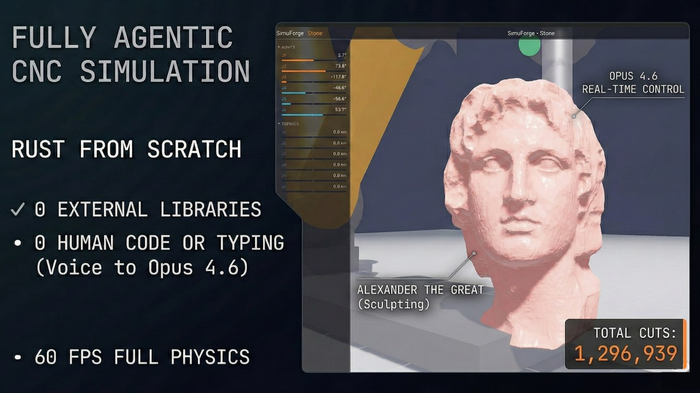

# SimuForge-Stone




A fully agentic digital twin CNC simulation — a 6DOF robot arm carving stone sculptures, built entirely from scratch in Rust with zero human code. Physics engine, material simulation, and renderer are all custom. No game engine, no ECS, no external physics library.

Every line of code was written by Claude Opus 4.6 via voice-to-AI, with the human directing architecture and design decisions. The first validated use case is a NEMA-stepper-driven articulated arm carving a marble bust of Alexander the Great from a 1ft block — 1.3M+ tool cuts with real-time SDF boolean subtraction at 0.5mm resolution.

See [`refs/`](refs/) for the original design conversation and research notes that led to this architecture.

## Architecture

```
G-code / Toolpath
       |
  IK Solver --> joint angle targets
       |
  PID Control Loop (1 kHz)
       |
  Motor Model --> torque output
       |
  Featherstone ABA --> joint accelerations --> integrate --> joint state
       |
  Forward Kinematics --> tool tip position
       |
  Material Removal (octree SDF subtract)  <-->  Cutting Force Model
       |
  Dirty chunk flags --> incremental surface nets meshing
       |
  wgpu chunk mesh upload --> PBR render (~60 fps, decoupled)
```

Physics runs at a **1 kHz fixed timestep** on the CPU. Rendering is decoupled at ~60 fps using the classic "Fix Your Timestep" accumulator pattern. Single-threaded — ABA + SDF update completes in <0.1 ms per step.

## Crate Layout

| Crate | Purpose |
|-------|---------|
| `core` | Shared types, DH parameters, coordinate conversions (nalgebra <-> glam) |
| `physics` | Featherstone ABA, spatial vectors, revolute joints, robot arm model |
| `motors` | Stepper motor speed-torque curves, planetary gearboxes, PID controllers |
| `material` | Sparse octree SDF (i16 quantized), CSG subtraction, async surface nets meshing, Fast Sweeping redistancing |
| `cutting` | Specific cutting energy model for stone, tool geometry (ball nose, flat, tapered) |
| `control` | Damped least-squares IK, trapezoidal trajectory planner, G-code interpreter |
| `render` | wgpu Vulkan renderer: PBR, shadow maps, SSAO, subsurface scattering, compositing |
| `carver` | Direct G-code → SDF carving engine (batch processing, G-code → STL export) |
| `sim` | Main binary: simulation loop, state orchestration, Cartesian IK control, overlays |

## Dependencies

Six external crates. Everything else is custom.

| Crate | Role |
|-------|------|
| `wgpu` 24 | Rendering + compute (Vulkan backend) |
| `winit` 0.30 | Window creation + input |
| `nalgebra` 0.33 | Physics-side math (Matrix6, Isometry3, spatial vectors) |
| `glam` 0.29 | Render-side math (SIMD f32, required by fast-surface-nets) |
| `bytemuck` | Zero-copy GPU buffer uploads |
| `fast-surface-nets` | Chunk-based isosurface extraction from SDF |

## Robot Arm Specification

Modeled from a real BOM (~$3K build). DH convention with Z-up.

| Joint | a (mm) | d (mm) | alpha | Range | Motor | Gearbox |
|-------|--------|--------|-------|-------|-------|---------|
| J1 | 0 | 300 | -pi/2 | +/-180 deg | NEMA34 12 Nm | 100:1 planetary |
| J2 | 500 | 0 | 0 | -45 to 135 deg | NEMA34 12 Nm | 100:1 planetary |
| J3 | 400 | 0 | 0 | +/-135 deg | NEMA34 8.5 Nm | 100:1 planetary |
| J4 | 0 | 0 | -pi/2 | +/-180 deg | NEMA23 3 Nm | 50:1 planetary |
| J5 | 0 | 300 | pi/2 | +/-120 deg | NEMA23 3 Nm | 50:1 planetary |
| J6 | 0 | 80 | 0 | +/-360 deg | NEMA23 2 Nm | 50:1 planetary |
| RT | -- | -- | -- | +/-360 deg | NEMA34 8.5 Nm | 80:1 worm |

Total reach: ~1200 mm. Reflected motor inertia through gearboxes dominates link inertia by 40-670x and is modeled in the ABA dynamics.

## Key Physics Details

- **Featherstone ABA** -- O(n) forward dynamics with reflected motor inertia (`I_rotor * ratio^2`) added to the diagonal inertia term. Critical for geared systems where motor inertia dominates link inertia.
- **RNEA gravity compensation** -- Recursive Newton-Euler algorithm computes exact gravity torques including inter-joint coupling. Applied as feedforward in the control loop.
- **PID with anti-windup** -- Per-joint position controllers tuned for the high reflected inertia. Motor-side torque commands are amplified through gearbox ratio and efficiency.
- **SDF material removal** -- Swept capsule subtraction on a sparse octree at 0.5 mm resolution. Only dirty 32^3 chunks are remeshed per frame via fast-surface-nets.

## Controls

| Key | Action |
|-----|--------|
| Space | Play / pause simulation |
| W/A/S/D | Move target forward/left/back/right (150 mm/s) |
| Q/E | Move target down/up |
| I/K | Pitch tool orientation (tilt forward/back) |
| J/L | Yaw tool orientation (rotate left/right) |
| Shift + movement | Fine mode (50 mm/s position, 0.3 rad/s rotation) |
| X | Toggle spindle on/off |
| R | Reset target to current tool pose |
| Shift+R | Full reset: arm pose, velocities, PID state, and target |
| 1 | Snap camera to workpiece |
| 2 | Snap camera to arm |
| Mouse drag | Orbit camera |
| Scroll | Zoom |
| Middle click drag | Pan |

## Build and Run

```
cargo build
cargo test
cargo run
```

Requires Vulkan-capable GPU. Tested on Ubuntu 24.04 with standard Mesa/NVIDIA drivers.

## Current Status

**Done:**
- Featherstone ABA with reflected motor inertia
- RNEA gravity compensation
- PID position control with motor/gearbox chain
- Sparse octree SDF (i16 quantized) with CSG subtraction and chunk-based surface nets meshing
- Async multi-threaded chunk meshing with prioritized dirty-chunk processing
- SDF redistancing (connectivity cleanup + Fast Sweeping Eikonal solver)
- Cutting force model (specific cutting energy for marble)
- wgpu PBR renderer with shadow maps, SSAO, SSS, and ACES tonemapping
- Cartesian IK control (WASD/QE moves a target point, arm follows via damped least-squares IK)
- G-code interpreter with full toolpath execution and A-axis rotary table support
- Timelapse preview mode with speed ramping and trail visualization
- Direct carving pipeline: G-code → STL conversion for fast result preview
- Linear track for extended workspace reach
- egui overlay (joint angles, torques, tool position, IK status, cutting force)
- 53 tests across all crates, all passing

**Remaining:**
- Auto-toolpath generation from STL (slice + roughing + finishing passes)
- Multi-tool support and automatic tool changes
- Physical build validation against simulation

## Project Vision

This platform is designed as a general-purpose digital twin environment. The stone-carving robot arm is the first scenario, but the architecture supports any articulated manipulator with any end effector and any subtractive (or additive) manufacturing process. The same arm model can drive a physical build via the real BOM components once the simulation is validated.

## License

Apache 2.0
