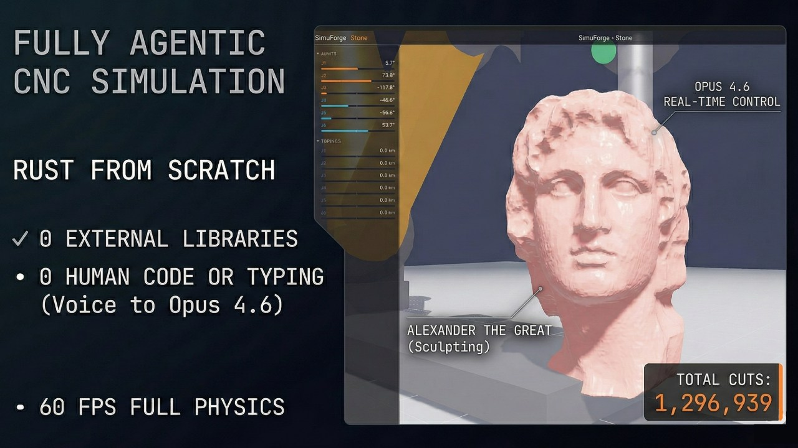

# SimuForge

<!-- hero image: replace with a wide screenshot of the drone fleet in flight -->



A multi-scenario digital twin platform built entirely from scratch in Rust. Custom physics, renderer, and audio engine — no game engine, no ECS, no external physics library. Every line of code written by Claude via voice-to-AI.

## Simulations

### Drone Fleet Mission (`simuforge-drone`)

50km GPS/INS-guided loitering munition simulation with full aerodynamics, procedural desert terrain, and fleet operations.

<!-- screenshot: drone in chase cam over desert with contrails -->
> *Screenshot placeholder: Chase camera view*

<!-- screenshot: fleet planner with 25 drones placed -->
> *Screenshot placeholder: Fleet planner UI*

<!-- screenshot: ground mode FLIR thermal view with YOLO box -->
> *Screenshot placeholder: Thermal IR + YOLO tracking*

<!-- screenshot: impact explosion with debris and smoke -->
> *Screenshot placeholder: Impact explosion*

**Flight Model**
- Point-mass aerodynamics at 200 Hz: lift, drag (with ground effect), thrust, gravity
- Angle of attack, lift coefficient (delta-wing vortex stall), drag polar (Cd0 + induced)
- Fuel burn, mass depletion, barometric air density
- Bank-to-turn coordinated flight

**Guidance & Navigation**
- GPS/INS waypoint following with S-curve avoidance maneuvers
- Flight phases: RATO launch, climb, cruise, terminal dive
- Per-drone CEP scatter (12m, matching real Shahed-136 GPS/INS accuracy)
- Terrain-aware ground impact using visual mesh interpolation

**Fleet Operations**
- Up to 100 simultaneous drones with unique colors (golden-angle hue distribution)
- Fleet planner with brush placement (1x / 5x / 10x / 25x formation stamps)
- Pan/zoom tactical map, click-to-place, staggered grid formations
- Tab to cycle primary drone, per-drone trails and minimap markers
- R resets fleet to launch positions without losing the formation

**Rendering**
- 4K HDR equirectangular skybox with bicubic (Catmull-Rom) sampling
- Procedural desert terrain (5-octave value noise, ±80m dunes, 21x21 tile grid)
- PBR with shadow maps, SSAO, SSS, ACES tonemapping
- Terrain-conforming target rings with proper normals and 1.5m extrusion
- Dynamic shadow priority (nearest 8 drones get shadows)

**Impact & Explosions**
- 5-layer explosion particles: fireball, sparks, debris, shockwave ring, billowing smoke
- 5-layer synthesized explosion audio: shockwave transient, blast wave, debris crackle, fireball rumble, echo tail
- 7 unique low-poly debris chunk meshes scatter with gravity, tumble, and ground bounce
- Terrain-aware particle collisions (sparks bounce off actual terrain surface)
- Camera freezes at impact vantage point

**Sensor Modes (Ground Camera)**
- FLIR thermal IR vision (5-stop color ramp shader, PBR alpha emission encoding)
- YOLO-style bounding box tracking with projected screen-space boxes
- Adjustable FOV zoom, click-to-place from minimap or fullscreen map

**Audio**
- Procedural 2-stroke piston engine (3-harmonic sawtooth + rumble, distance attenuation)
- 3-band aerodynamic wind noise (rumble, vortex shedding, boundary layer)
- RATO booster roar, multi-layer impact explosion with DC-blocked saturation
- Engine/wind auto-silence on fleet impact

**Controls**

| Key | Action |
|-----|--------|
| Space | Launch (single drone or planned fleet) |
| 1-5 | Time scale (1x / 10x / 50x / 100x / 200x) |
| C | Cycle camera (Orbit / Chase / Side / Ground) |
| M | Toggle fullscreen tactical map |
| Tab | Cycle primary drone |
| P | Pause |
| R | Reset mission (preserves fleet) |
| B | Back to drone camera |
| Scroll | Zoom (orbit) or FOV (ground) |

---

### CNC Stone Carving (`simuforge-sim`)

6DOF robot arm carving marble sculptures with real-time SDF boolean subtraction.

<!-- screenshot: arm carving marble with SSAO and subsurface scattering -->
> *Screenshot placeholder: CNC carving in progress*

- Featherstone ABA forward dynamics with reflected motor inertia (40-670x through gearboxes)
- RNEA gravity compensation, PID position control with anti-windup
- Sparse octree SDF (i16 quantized, 0.5mm resolution) with CSG subtraction
- Async chunk-based surface nets meshing with Fast Sweeping redistancing
- G-code interpreter with A-axis rotary table, trapezoidal trajectory planning
- Damped least-squares IK with nullspace centering and adaptive damping

---

### Table Tennis (`simuforge-pingpong`)

Two 5-DOF robot arms playing table tennis with full physics.

<!-- screenshot: ping pong rally -->
> *Screenshot placeholder: Table tennis rally*

- Two articulated robot arms with Featherstone ABA dynamics, PID control, and gearbox models
- Ball physics: gravity, air drag, Magnus effect (spin-dependent lift), spin decay
- Table/net/paddle/floor collisions with coefficient of restitution and friction
- AI opponent with predictive ball tracking, reach-through return strategy, and configurable difficulty
- Scoring, serve rules, game state machine (serve / rally / point scored)
- Procedural audio: table bounce, paddle hit, net hit, floor bounce (spatially panned)
- PBR rendering with shadow maps, SSAO, egui HUD with score and controls

---

## Architecture

```
                      SimuForge Platform
                            |
        ┌───────────────────┼───────────────────┐
        |                   |                   |
   simuforge-sim      simuforge-drone     simuforge-pingpong
   (CNC Carving)     (Drone Fleet)       (Table Tennis)
        |                   |                   |
        └───────┬───────────┼───────────────────┘
                |           |
        ┌───────┴───┐  ┌───┴────┐
        | Shared     |  | Per-sim |
        | Libraries  |  | Modules |
        ├────────────┤  ├────────┤
        | core       |  | flight |
        | physics    |  | guidance|
        | motors     |  | terrain |
        | material   |  | particles|
        | cutting    |  | skybox  |
        | control    |  | sound   |
        | render     |  | drone   |
        | audio      |  |         |
        └────────────┘  └─────────┘
```

## Crate Layout

| Crate | Purpose |
|-------|---------|
| `core` | Shared types, DH parameters, coordinate conversions (nalgebra f64 <-> glam f32) |
| `physics` | Featherstone ABA, spatial vectors, revolute joints, robot arm model |
| `motors` | Stepper motor speed-torque curves, planetary gearboxes, PID controllers |
| `material` | Sparse octree SDF (i16 quantized), CSG subtraction, surface nets, Fast Sweeping |
| `cutting` | Specific cutting energy model for stone, tool geometry |
| `control` | Damped least-squares IK, trajectory planner, G-code interpreter |
| `render` | wgpu Vulkan renderer: PBR, shadow maps, SSAO, SSS, compositing, line pipeline |
| `audio` | Real-time audio engine with voice mixing and stereo panning |
| `sim` | CNC carving simulation binary |
| `drone` | Drone fleet mission simulation binary |
| `pingpong` | Table tennis simulation binary |
| `carver` | Headless G-code to STL batch processor |

## Build and Run

```bash
cargo build --release
cargo test

# CNC stone carving
cargo run -p simuforge-sim --release

# Drone fleet mission
cargo run -p simuforge-drone --release

# Table tennis
cargo run -p simuforge-pingpong --release
```

Requires Vulkan-capable GPU. Tested on Ubuntu 24.04.

## Dependencies

Six core external crates. Everything else is custom.

| Crate | Role |
|-------|------|
| `wgpu` 24 | GPU rendering (Vulkan backend) |
| `winit` 0.30 | Window creation + input |
| `nalgebra` 0.33 | Physics math (f64 spatial vectors, matrices) |
| `glam` 0.29 | Render math (SIMD f32) |
| `bytemuck` | Zero-copy GPU buffer uploads |
| `fast-surface-nets` | Isosurface extraction from SDF |

## License

Apache 2.0
